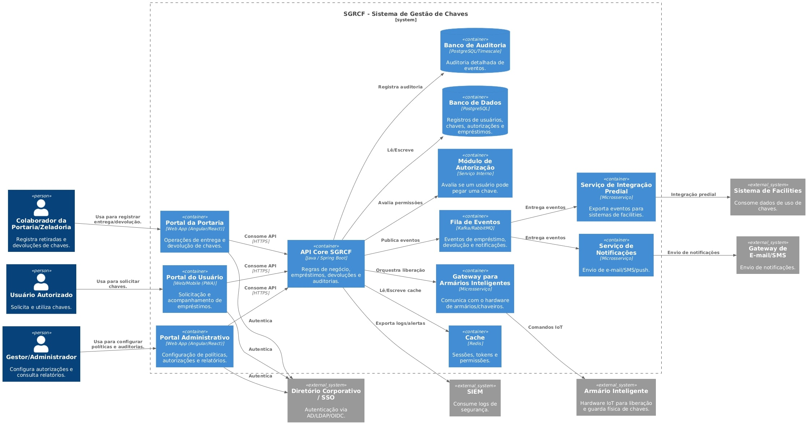
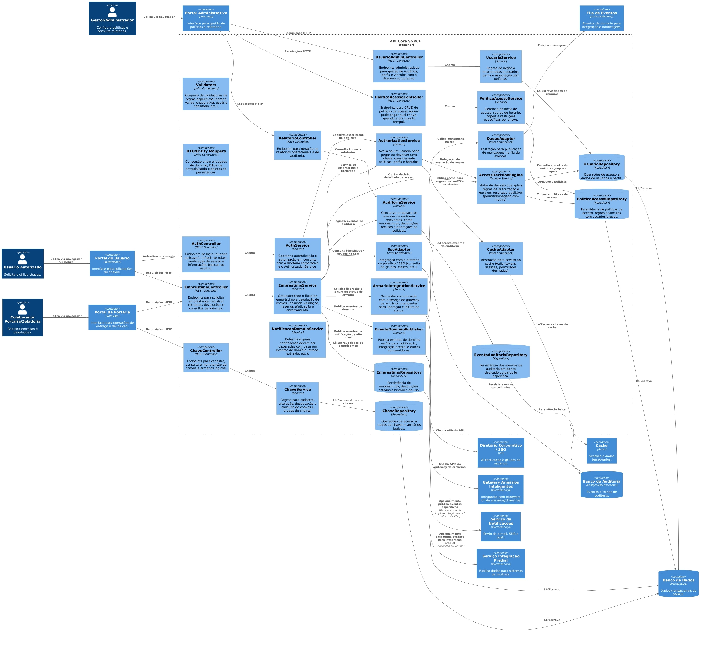
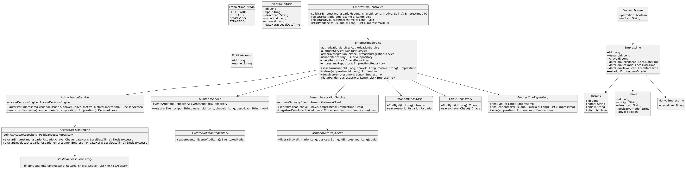

# Modelo C4 - Sistema de Gestão e Rastreamento de Chaves Físicas (SGRCF)

Disciplina: Projeto e Design de Software  

Professor: Fábio Nogueira de Lucena (INF/UFG)  

Aluno: Nícolas Georgeos Mantzos  

Matrícula: 2025200254  

---
## Introdução

O Modelo C4 é uma abordagem de documentação arquitetural criada por Simon Brown, cujo objetivo é representar sistemas de software através de diferentes níveis de abstração, de forma clara, gradual e compreensível para públicos técnicos e não técnicos. O nome faz referência aos seus quatro níveis de detalhamento: Contexto, Contêineres, Componentes e Código, permitindo visualizar desde o panorama geral do sistema até os detalhes de implementação.

Neste documento, o Modelo C4 é aplicado ao SGRCF — Sistema de Gestão e Rastreamento de Chaves Físicas desenvolvido durante a disciplina de requisitos, uma solução proposta para controlar o ciclo de vida de chaves físicas utilizadas em ambientes corporativos, acadêmicos, residenciais ou institucionais.

---

## Objetivo do Sistema

O SGRCF busca garantir governança, rastreabilidade, autorização baseada em regras, auditoria e redução de extravios, substituindo abordagens manuais, informais ou suscetíveis a falhas, como registros em papel, planilhas ou comunicação verbal, por uma plataforma centralizada para registro, monitoramento e auditoria de empréstimos e devoluções de chaves físicas, respondendo às seguintes necessidades:

- Identificar quem retirou uma chave, quando e com qual finalidade;  
- Estabelecer regras de autorização baseadas em perfil, horário e setor;  
- Registrar e auditar eventos de forma confiável e rastreável;  
- Reduzir incidentes de extravio e acessos não autorizados;  
- Integrar-se a dispositivos físicos como armários inteligentes e sistemas externos.

---

##  Nível 1 — Diagrama de Contexto

O Diagrama de Contexto apresenta uma visão macro do SGRCF, destacando seu papel dentro do ambiente organizacional, os usuários que interagem com o sistema e outros sistemas externos envolvidos.  
Ele define quem utiliza o sistema, quem administra, quem concede o acesso e quais integrações externas complementam o fluxo de trabalho.

A partir desta visão, entende-se que o SGRCF é um sistema cujo propósito é controlar e monitorar o ciclo de vida das chaves físicas, servindo como ponto central de autorização, registro e auditoria, conectando usuários humanos, dispositivos físicos (armários inteligentes) e serviços corporativos como autenticação e notificações.

Principais destaques do contexto:
- Há três atores principais: usuário autorizado, colaborador (portaria/zeladoria) e gestor/administrador.
- O sistema se integra a serviços como SSO/LDAP, sistemas de notificação e armários inteligentes.
- A segurança, o controle e a rastreabilidade são os pilares centrais do domínio.

---

## Nível 2 — Diagrama de Contêineres

O Diagrama de Contêineres detalha como o SGRCF é estruturado em termos de tecnologias, módulos e responsabilidades.  
Cada contêiner representa uma parte executável ou componente distribuível do sistema, tais como aplicações web, APIs, banco de dados e serviços auxiliares.

Nesta visão, é possível identificar:
- Três front-ends distintos, voltados para perfis diferentes (usuário, portaria e gestão);
- Uma API central, responsável por todas as regras de negócio e integrações;
- Uma camada de persistência, separando dados operacionais e auditoria;
- Serviços auxiliares como notificações, cache, fila de eventos, monitoramento e integração IoT.

Essa arquitetura sugere uma abordagem escalável, segura e preparada para evolução modular, permitindo crescimento através de microsserviços, adoção de armários inteligentes e integração com sistemas corporativos de segurança predial.

---
## Nível 3 — Diagrama de Componentes

O Diagrama de Componentes aprofunda a visão arquitetural apresentada no nível de contêineres, detalhando de forma mais granular a organização interna do contêiner API Core SGRCF, que é responsável por todas as regras de negócio do sistema.  
Esse diagrama descreve como a lógica do domínio é organizada, quais módulos compõem o serviço, como eles interagem entre si e como efetuam integrações com recursos externos, como cache, fila de eventos, autenticação corporativa e comunicação com armários inteligentes.

A API é organizada em três principais camadas:

1. Camada de Entrada (Controllers / Adapters HTTP)  
   Responsável por expor endpoints REST e traduzir requisições de aplicações cliente (portais web e mobile) em comandos ou consultas para os serviços internos.  
   Exemplos: `AuthController`, `EmprestimoController`, `RelatorioController`.

2. Camada de Aplicação e Regras de Negócio (Services)  
   Nesta camada estão os componentes que coordenam workflows, validam fluxos, aplicam políticas e orquestram integração com outros módulos.  
   Exemplos: `EmprestimoService`, `PoliticaAcessoService`, `AuditoriaService`, `EventoDominioPublisher`.

3. Camada de Infraestrutura e Persistência (Repositories / Adapters)  
   Concentra o acesso a bancos de dados, cache, fila de eventos, serviços externos e módulos dedicados de integração.  
   Exemplos: `UsuarioRepository`, `EventoAuditoriaRepository`, `CacheAdapter`, `SsoAdapter`.

Também é apresentado o módulo de autorização e tomada de decisão, formado por `AuthorizationService` e `AccessDecisionEngine`, que tem papel central no sistema, pois valida se um usuário pode ou não retirar determinada chave em determinado contexto, além de registrar os motivos da decisão para auditoria posterior.

Essa arquitetura favorece:

- coesão por funcionalidade e separação de responsabilidades  
- evolução modular com possibilidade futura de microservices independentes  
- testabilidade, uma vez que controllers, serviços e repositórios podem ser mockados  
- auditabilidade, com registro detalhado do ciclo de vida das chaves  
- interoperabilidade, graças a pontos de integração bem definidos e desacoplados  

---
## Nível 4 — Diagrama de Código

O Diagrama de Código representa o nível de maior granularidade dentro do Modelo C4, descrevendo de forma precisa os elementos internos da implementação e a relação entre eles. Neste nível, o foco deixa de ser arquitetura e estrutura do sistema para se concentrar na organização lógica do código-fonte, com destaque para o domínio, responsabilidades e dependências entre classes.

Este diagrama para o SGRCF apresenta uma modelagem com foco em princípios de DDD (Domain-Driven Design), separando claramente:

- Classes de entrada (interfaces com atores e sistemas externos)
- Classes de aplicação (coordenação de caso de uso)
- Serviços de domínio (regras de decisão)
- Entidades de domínio e Objetos de Valor
- Interfaces de repositórios e integração

Dessa forma, os quatro pilares da orientação a objetos aparecem de maneira prática:  
encapsulamento, abstração, responsabilidade única (SRP) e baixo acoplamento.

---

### Estrutura Lógica Representada

O diagrama segue uma organização natural que pode ser mapeada para pastas/pacotes no código real:

| Camada | Elementos | Responsabilidade Principal |
|--------|-----------|----------------------------|
| Interface (Entrada) | `EmprestimoController` | Receber requisições, validar formato e delegar processamento |
| Aplicação (Use Cases) | `EmprestimoService`, `AuthorizationService`, `AuditoriaService`, `ArmarioIntegrationService` | Orquestrar regras e integrações do caso de uso |
| Domínio | `Usuario`, `Chave`, `Emprestimo`, `MotivoEmprestimo`, `DecisaoAcesso` | Representar o coração da regra de negócio |
| Serviços de Domínio | `AccessDecisionEngine` | Definir regras, critérios e variáveis de decisão |
| Persistência/Integração | `*Repository`, `ArmarioGatewayClient` | Comunicação com banco de dados e sistemas externos |

---

### Insights sobre a Modelagem

- O fluxo de empréstimo é tratado como um _aggregate root_, garantindo consistência transacional.
- As entidades possuem identidade explícita (ID), característica essencial para auditoria.
- O estado do empréstimo é representado por um `enum`, facilitando validação, workflow e integração com relatórios.
- `DecisaoAcesso` e `MotivoEmprestimo` são Objetos de Valor, pois sua relevância está no conteúdo e não na identidade.
- A lógica de autorização foi isolada em um serviço específico, deixando o caso de uso desacoplado de avaliações complexas.
- `AccessDecisionEngine` permite evolução futura para modelos baseados em AI, feature flags ou regras externas (Drools, OPA, DSL).
- A auditoria é realizada como evento de domínio, facilitando rastreabilidade e requisitos legais.
